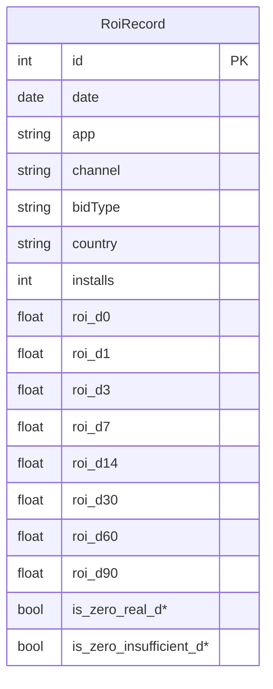

# 系统设计

## 架构概览

- 前端：Next.js 14（App Router），Tailwind + shadcn/ui，Recharts
- 后端：Express + TypeScript，Prisma 管理 MySQL
- 渲染：CSR
- 状态：Hooks + 轻量本地状态

## 数据库表结构
见 `backend/prisma/schema.prisma`，关键点：
- 以 **小数** 存储 ROI（1.0 = 100%）
- 通过 `is_zero_real_*` / `is_zero_insufficient_*` 区分 0% 的两类来源
- 常用维度建立索引

## API 设计

- `GET /api/roi/filters`：返回 apps / countries / channels / bidTypes
- `GET /api/roi`：参数
  - `app? country? channel? bidType? start? end?`
  - `mode=raw|ma7`（移动平均）
  - `scale=linear|log`
  - `limitDays=90`（未指定日期时裁剪）
- `POST /api/import/upload` / `POST /api/import/path`：批量导入

## 关键算法与处理

### 移动平均（MA7）
后端以 7 日均线返回，也可前端自行计算。当前实现为**后端计算**。

### 0% 的两类含义
- **真实 0**：`is_zero_real_dX = true`
- **日期不足 0**：若 `maxDate - date < X 天` 则 `is_zero_insufficient_dX = true`

### 预测（可选）
- 简单线性回归：对最近 N 点（7~14）拟合趋势，预测未来 7 天，返回 `futureDates` 与 `forecast`；前端以虚线呈现。
